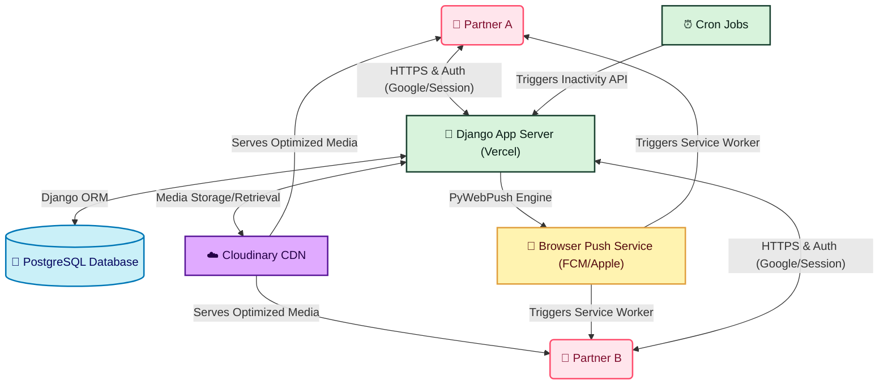

# 💖 Couple Tracker - The Ultimate Relationship App 💖

  

   

  

    
    
    
    
    
    
  

  <h3><strong>✨ Track, Cherish, and Grow Your Love Live! ✨</strong></h3>

  

  

    <a href="#about-the-project"><b>📖 About</b></a> •
    <a href="#system-architecture--deep-dive"><b>🧠 Architecture</b></a> •
    <a href="#outstanding-features"><b>✨ Features</b></a> •
    <a href="#how-it-works"><b>⚙️ Workflow</b></a> •
    <a href="#local-installation--setup"><b>🚀 Installation</b></a> •
    <a href="#tech-stack--languages-used"><b>🛠 Tech Stack</b></a>
  

---

## 📖 About The Project

**Couple Tracker** is an interactive, feature-rich web application built to bring couples closer. Whether you're tracking your shared goals, saving the most precious memories, aligning your moods, or just planning the next movie night, this application serves as your personal relationship digital diary!

With a beautifully designed UI, smooth functionality, and secure user authentication, Couple Tracker acts as your all-in-one private hub. 

---

## ✨ Outstanding Features

Discover a magical ecosystem crafted specifically for couples:

- 🔐 **Dual-End Authentication**: Secure sign-up, login (including Google OAuth), password resets, and OTP verifications to keep your data private and safe.
- 👩‍❤️‍👨 **Couple Connection System**: Create a couple profile and securely invite your partner to join your digital world.
- 📸 **Memory Lane & Snaps**: Upload cherished photos to your memory album, manage snapshots, and never lose a sweet moment. Cloudinary handles all media storage efficiently!
- 📅 **Milestone Tracking**: Never forget an anniversary or an important date! Add, edit, and visualize your relationship milestones.
- 😊 **Mood Sync**: A real-time Mood Tracker. Log your mood and see your partner's mood instantly. Better communication starts with knowing how the other feels!
- 🍿 **Movie & Review Tracker**: Plan your next binge! Add movies, write shared reviews, and rank your favorite films.
- 🎶 **Shared Playlists & Songs**: Connect and manage your favorite shared songs and playlists. Music connects hearts!
- 🎯 **Bucket List**: A dynamic checklist of everything you both want to accomplish together. Dream big and cross them off one by one!
- 🌸 **Period Tracker**: Built-in functionality specifically to stay aware and supportive.
- 🔔 **Push Notifications & Reminders**: Web push notifications (via pywebpush) and automated inactivity cron jobs ensure you are always engaged and reminded of your love.

---

## ⚙️ How It Works

### Application Architecture

### User Flow

1. **Onboarding**: Users register for an account (Standard or via Google).
2. **Pairing**: A user creates a "Couple" and generates a link/code for their partner. Their partner joins, linking their accounts in the database.
3. **The Dashboard**: Once paired, both users land on a shared dashboard where they can interact with the various modules.
4. **Real-time Syncing**: As you upload a memory, add a movie, or update your mood, it reflects directly in your partner's dashboard seamlessly!

---

## 🛠 Tech Stack & Languages Used

This project relies on a robust set of modern technologies:

### 🎨 Frontend
- **HTML5 & CSS3**: For structural layout and beautiful custom styling.
- **JavaScript (Vanilla/ES6)**: To handle interactive UI, AJAX requests, DOM manipulation, Modal interactions, and Web Push Service Workers.
- *(Note: Embellished with beautiful typography via Google Fonts and crisp icons)*

### 🧠 Backend
- **Python (v3.x)**: The core programming language powering the logic.
- **Django (v5.0.6)**: A high-level Python web framework encouraging rapid development and clean design.
- **Authentication**: `google-auth` for seamless Google logins and Django's robust default authentication system.

### 🗄 Database & Storage
- **PostgreSQL**: Relational database handling structured data (Users, Couples, Movies, Reviews).
- **Cloudinary**: High-performance cloud storage for all couple images and memories.

### 🚀 Deployment & Utilities
- **Vercel**: `vercel.json`, `gunicorn`, `whitenoise`, and `dj-database-url` perfectly configured to deploy as a serverless or managed platform application.
- **Asynchronous/Push Services**: `pywebpush` and `py-vapid` for web push notifications.
- **Payments (Optional Module)**: `razorpay` integration included for any premium upgrade options.

---

  
<i>Made with ❤️ by AKASH</i>

  

